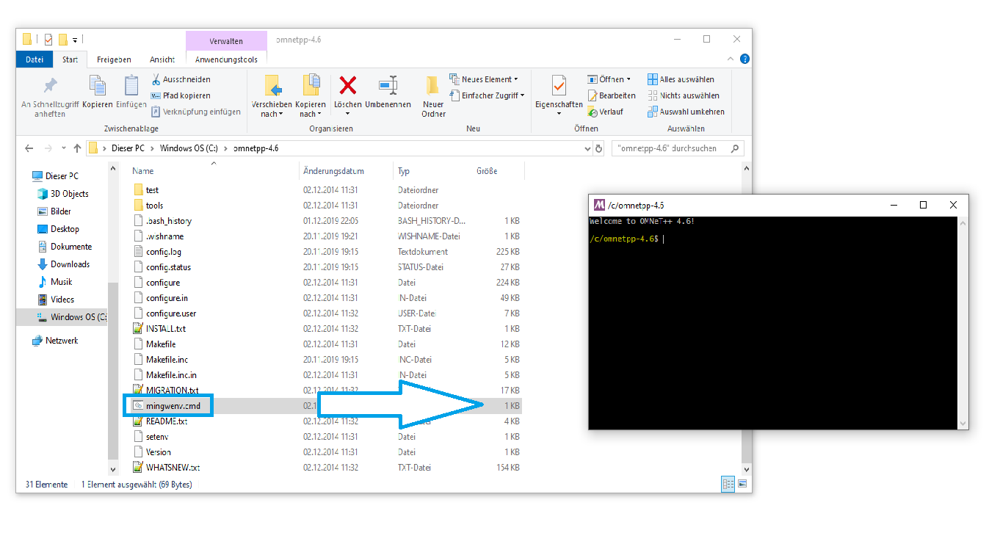
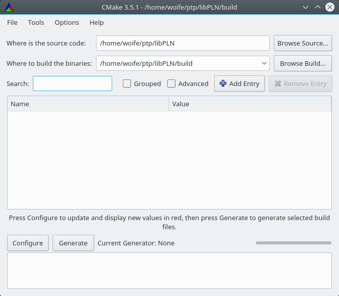
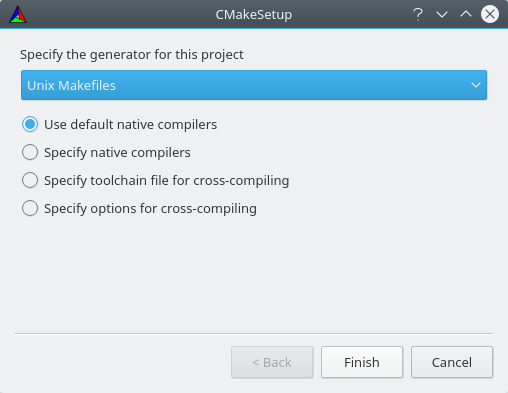
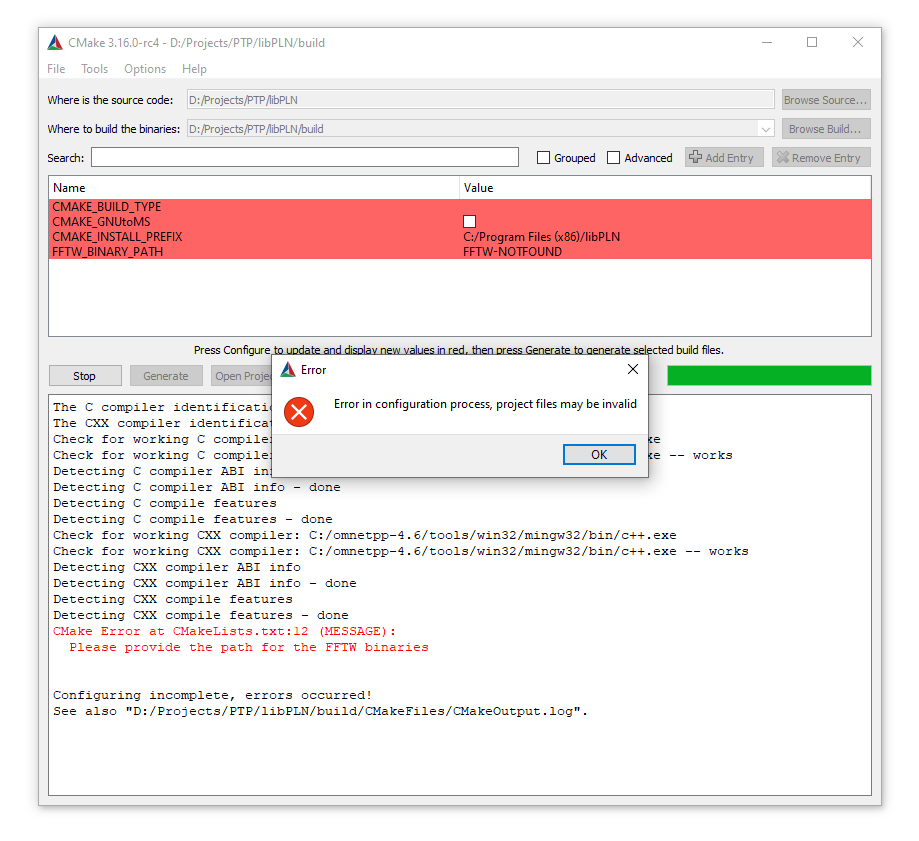
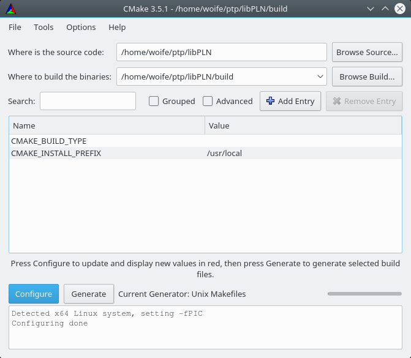
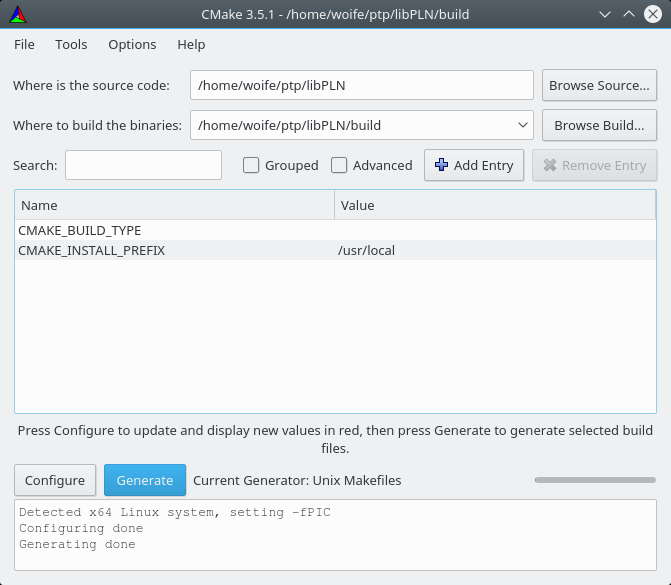

# LibPLN Install Guide

This Install Guide describes how to build and install the components of the _libPLN_ project.

## Provided Components

The libPLN projects provides the following components:

* __libPLN:__ This is the main library. All other components are based on this library.
* __libPLN_Examples:__ A library with example oscillators implemented using libPLN.
* __SimpleDemo:__ A rather simple demo program to demonstrate the usage of the libPLN library in other programs.
* __PLN_Generator:__ A more sophisticated demo program implementing the simulations of continuously sampled time deviation samples.
* __TestBench:__ A test program used during development to catch regressions.

The components __libPLN__ and __libPLN_Examples__ are the most useful ones. This Install Guide is valid for all mentioned components, except for the last step, where we only build and install __libPLN__ and __libPLN_Examples__.

## Supported Platforms

The following platforms are supported:

* __Linux__
  * Kubuntu 16.04
  * Kubuntu 19.10
* __Windows__
  * Windows 10 using the [OMNeT++][1] build environment

__Remark regarding portability:__
LibPLN was designed to be portable, thus it is likely that it will work also on other platforms where its requirements are met. If you would like to port libPLN to other platforms or to provide build instructions for other platforms, contact us in the [ptp-sim forum][2]!

[1]: https://omnetpp.org/
[2]: http://ptp-sim.boards.net/

## Requirements

The following components are required to build libPLN:

* CMake
  * The libPLN project uses [CMake][14] as its build system generator. There are multiple user interfaces available for CMake, and if you know how to use CMake you can use either of them. For the rest of this guide we will use the CMake QT GUI, as it is easy to use.
* A C++ build environment
  * On Linux, libPLN has been tested with the GNU toolchain.
  * On Windows, libPLN has been tested with the GNU toolchain as it is provided by the [OMNeT++][15] network simulation framework.
* The [Boost][16] library
  * LibPLN itself requires _boost-random_, which is a header-only library.
  * PLN\_Generator additionally depends on _boost-program-options_ (which is not a header-only library)
* The [FFTW32][17] library, which is required by libPLN for the FFT implementation

Additionally, we assume that the user is familiar the following items:
* Using a [command-line interface][18]
* Building C++ programs with [make][19]
* Using [CMak_][14]

[14]: https://cmake.org/
[15]: https://omnetpp.org/
[16]: http://www.boost.org/
[17]: http://www.fftw.org/
[18]: https://en.wikipedia.org/wiki/Command-line_interface
[19]: https://en.wikipedia.org/wiki/Make_(software)

## Building libPLN

### Step 1: Installing the requirements

__Remark:__ The build process can fail if the paths to any of the required components or to the build folder of libPLN contain whitespaces. For this install guide it is recommended to avoid whitespaces in any paths.

#### Kubuntu 16.04 and 19.10

On Kubuntu (and also Ubuntu as well) execute the following commands to install the required components.

* __CMake__
> sudo apt install cmake-qt-gui

* __Build environment__
> sudo apt install g++

* __FFTW__
> sudo apt install libfftw3-dev

* __Boost__
> sudo apt install libboost-random-dev libboost-program-options-dev

#### Windows 10

* __CMake__
Download CMake from the [project website][20] and install it.

* __Build environment__
Download [OMNeT++ 4.6][21], and install it according to the [OMNeT++ 4.6 Install Guide][22].

* __FFTW__
The FFTW project provides a page with [install instructions for Windows][23].
Download the zip file of the 32-bit version, and unzip it somewhere on your disk.

* __Boost__
Download the boost library from the [boost website][24].
LibPLN requires only header-only components of boost.
So if you would only like to build libPLN it is enough to download and unzip the boost library to your disk.

If you would also like to build the PLN\_Generator tool, you also need boot\_program\_options, which needs to be compiled.
We recomment to follow the [Getting Started Guide][25] on how to compile the boost library.
__Remark:__ Building PLN_Generator on Windows is currently not supported/tested.

[20]: https://cmake.org/download/
[21]: https://github.com/omnetpp/omnetpp/releases/download/omnetpp-4.6/omnetpp-4.6-src-windows.zip
[22]: https://doc.omnetpp.org/omnetpp4/InstallGuide.pdf
[23]: http://www.fftw.org/install/windows.html
[24]: https://www.boost.org/
[25]: https://www.boost.org/doc/libs/1_72_0/more/getting_started/index.html

### Step 2: Console Environment

__Step 2.1:__ We will carry out the following steps on the command line, and for this we need a suitably configured console enviroment.
* __Linux:__ Under Linux, the needed tools, libraries and headers should already be installed in their default locations. Because of this, we can use any console appliation without any special settings. E.g. on Kubuntu you can use the program _konsole_.
* __Windows:__ We use the OMNeT\+\+ build environment under Windows. The default OMNeT\+\+ installation provides us a suitable console. Open the file _mingwenv.cmd_ in the OMNeT\+\+ directory, which should start the OMNeT\+\+ console environment. This is shown in the image below.

__Step 2.2:__ Within the console, change to the libPLN folder.

### Step 3: Makefile generation with CMake

__Step 3.1:__ Create a build folder, and change into that folder:
> mkdir build  
> cd build

__Step 3.2:__ Start the CMake GUI, and provide a relative path to the parent directory as an argument ("..")

* __Linux:__ `$ cmake-gui ..`
* __Windows:__ `$ cmake-gui.exe ..`

This will open a window as shown below.

__Step 3.3:__ Click on the `Configure` button. This will open a pop up window which asks you for your build preferences. This pop up window is shown below.

Choose __UNIX Makefiles__ as the generator and select __Use default native compilers__. Click on `Finish` to close that window. This will trigger the _Configure_ process of CMake. 

The following step is needed only on Windows. Linux users may continue at step 3.5.

__Step 3.4 (Windows only):__ 

After clicking `Configure` on Windows, CMake will show you an error as shown below. The reason is that it could not automatically find the FFTW library.

Click `OK` in the error popup, and enter the path to the FFTW libary in the _FFTW\_BINARY\_PATH_ field (instead of the _FFTW-NOTFOUND_ entry).

Click `Configure` again. CMake will show an error again. This time it can't find the boost libary. Acknowledge the error again by clicking `OK`, and enter the path to the boost library in the field _BOOST\_BINARY\_PATH_ (instead of the _BOOST-NOTFOUND_ entry).

Click `Configure` again. You can now continue at step 3.5.

__Step 3.5:__ The CMake window  should now look as shown below. Some fields might still be highlighted in read, but this is normal.

__Step 3.6:__ Click on the `Configure` button again. Now there should be no highlighted fields any more.

__Step 3.7:__ Click on the `Generate` button. This generates the file _Makefile_ which we will use for building libPLN.

__Step 3.8:__ Close the CMake GUI again. You should now have a filed called _Makefile_ in your build directory.

### Step 4: Building and Installing

The Makefile produced by CMake provides different make targets to build the individual components:

* __`PLN`__ Builds libPLN (as static library)
* __`PLN_Examples`__ Builds libPLN_Examples (as static library)
* __`SimpleDemo`__ Builds the simple demo
* __`PLN_Generator`__ Builds the program _PLN_Generator_
* __`TestBench`__ Builds the testbench
* __`all`__ (default target) Calls the __`PLN`__ and __`PLN_Examples`__ build targets
* __`install`__ Installs `libPLN` and `libPLN_Examples` in the `lib/static` directory

__Step 4.1:__ Call`make all`:

> $ make all  
> [  2%] Building CXX object src/CMakeFiles/PLN.dir/TdEstChain.cpp.o  
> [  4%] Building CXX object src/CMakeFiles/PLN.dir/TdOracle.cpp.o  
> ...  
> [ 73%] Building CXX object src/CMakeFiles/PLN.dir/Utils/VectorTypes.cpp.o  
> [ 76%] Linking CXX static library libPLN.a  
> [ 76%] Built target PLN  
> [ 78%] Building CXX object Examples/CMakeFiles/PLN_Examples.dir/AverageOscillator_20MHz/AverageOscillator_20MHz.cpp.o  
> ...  
> [100%] Linking CXX static library libPLN_Examples.a  
> [100%] Built target PLN_Examples  

__Step 4.2:__ Call`make install`:

> $ make install  
> [ 76%] Built target PLN  
> [100%] Built target PLN_Examples  
> Install the project...  
> -- Install configuration: ""  
> -- Installing: /home/woife/ptp/libPLN/build/lib/static/libPLN.a  
> -- Installing: /home/woife/ptp/libPLN/build/lib/static/libPLN_Examples.a  

Now you should have two static library files in the path _lib/static_:

> $ ls lib/static/  
> libPLN.a  
> libPLN_Examples.a  

Congratulations, you have successfully built __libPLN__ and __libPLN_Examples__.

## Further Steps

If you have built _libPLN_ to use it with PTP simulations based on _libPTP_ you can follow the [Install Guide](https://ptp-sim.github.io/Install_Guide) of the __ptp-sim__ project for instructions on how to use _libPLN_ with _libPTP_.