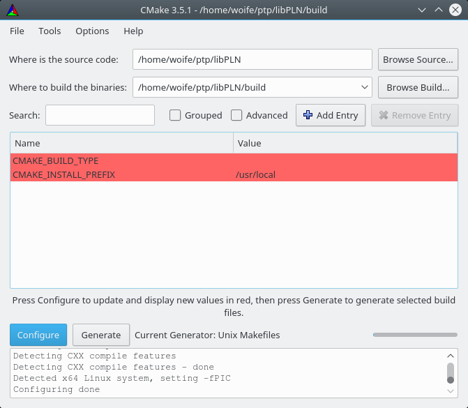

# LibPLN Install Guide

## Supported Platforms

The following platforms are supported:

* __Linux__ (tested on Kubuntu 16.04 and 19.10)
* __Windows__ (tested on Windows 7 using Cygwin and MinGW)

_Remark:_ LibPLN was designed to be portable, thus it is likely that it will work also on other platforms where the requirements are met.

## Requirements

The libPLN project uses [CMake][5] as its build system.
Additionally, it depends on

* the [Boost][6] library, especially _boost-random_ and _boost-program-options_
* the [FFTW32][7] library

These libraries need to be present on your system for a successful build.

[5]: https://cmake.org/
[6]: http://www.boost.org/
[7]: http://www.fftw.org/

## Installation steps for Linux

We assume a __Kubuntu 16.04__ installation in this section. The steps should be similar for other distributions.

### Step 1: Preparation

* Install the requirements listed above. There are multiple options how CMake can be used, for this guide we will use the GUI variant for CMake. The needed packages can be installed by executing:
> sudo apt install cmake-qt-gui libfftw3-dev libboost-random-dev libboost-program-options-dev

* Change to the libPLN folder

### Step 2: Makefile generation with CMake

* Create a build folder, and change into that folder:
> mkdir build
> cd build

* Start the CMake GUI
> cmake-gui ..

* Choose standard UNIX Makefiles as the build target

* Click on the `Configure` button in the CMake GUI. Some fields are highlighted in red, this is normal.

* Click on the `Configure` button again. Now there should be no highlighted fields any more.

* Click on the `Generate` button. This generates the file _Makefile_ which we will use for building libPLN.

* Close the CMake GUI again. You should now have a filed called _Makefile_ in your build directory.

### Step 3: Building and Installing

* The libPLN projects provides the following components:

  * __libPLN:__ The main `libPLN` library. All other components are based on this one.
  * __libPLN_Examples:__ A library with example oscillators implemented using libPLN.
  * __TestBench:__ A test program used during development to catch regressions
  * __SimpleDemo:__ A rather simple demo program to demonstrate the usage of libPLN
  * __PLN_Generator:__ A more sophisticated demo program implementing the simulations of continuously sampled time deviation samples.

* The Makefile produced by CMake provides different make targets to build the individual components:

  * __`PLN`__ Builds libPLN (as static library)
  * __`PLN_Examples`__ Builds libPLN_Examples (as static library)
  * __`TestBench`__ Builds the testbench
  * __`SimpleDemo`__ Builds the simple demo
  * __`PLN_Generator`__ Builds the program _PLN_Generator_
  * __`all`__ (default target) Calls the __`PLN`__ and __`PLN_Examples`__ build targets
  * __`install`__ Installs `libPLN` and `libPLN_Examples` in the `lib/static` directory

* Call`make all`:

> $ make all  
> [  2%] Building CXX object src/CMakeFiles/PLN.dir/TdEstChain.cpp.o  
> [  4%] Building CXX object src/CMakeFiles/PLN.dir/TdOracle.cpp.o  
> ...  
> [ 73%] Building CXX object src/CMakeFiles/PLN.dir/Utils/VectorTypes.cpp.o  
> [ 76%] Linking CXX static library libPLN.a  
> [ 76%] Built target PLN  
> [ 78%] Building CXX object Examples/CMakeFiles/PLN_Examples.dir/AverageOscillator_20MHz/AverageOscillator_20MHz.cpp.o  
> ...  
> [100%] Linking CXX static library libPLN_Examples.a  
> [100%] Built target PLN_Examples

* Call`make install`:

> $ make install  
> [ 76%] Built target PLN  
> [100%] Built target PLN_Examples  
> Install the project...  
> -- Install configuration: ""  
> -- Installing: /home/woife/ptp/libPLN/build/lib/static/libPLN.a  
> -- Installing: /home/woife/ptp/libPLN/build/lib/static/libPLN_Examples.a

* Now you should have two static library files in the path _lib/static_:

> $ ls lib/static/
> libPLN.a
> libPLN_Examples.a

## Installation steps for Windows

This section is still under construction.
