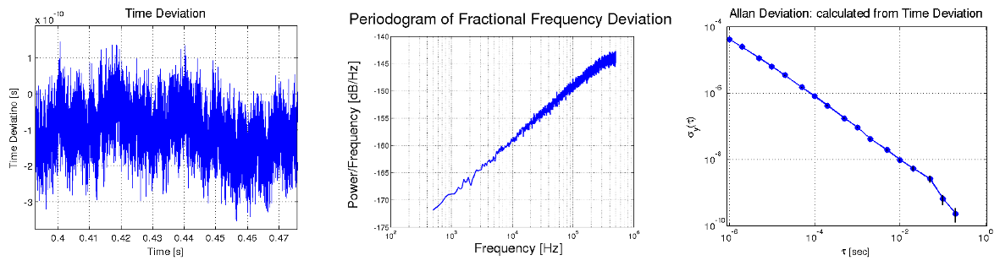
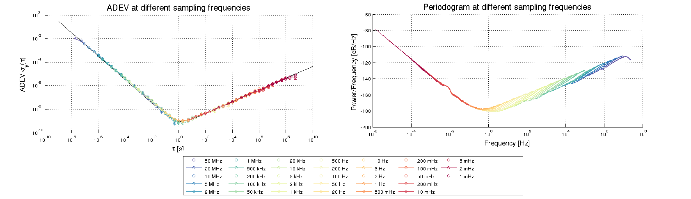
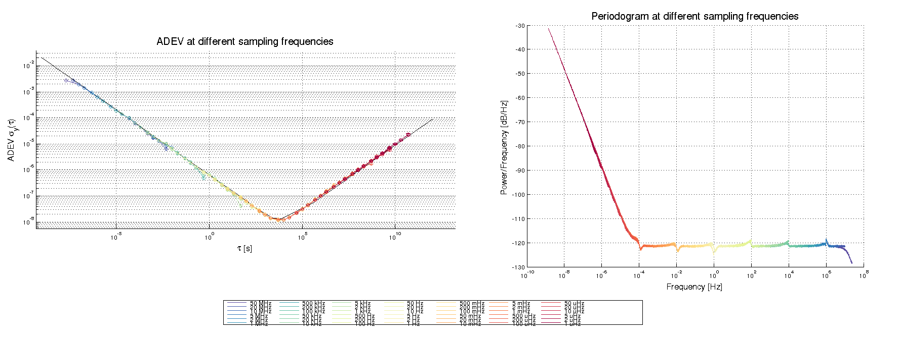

LibPLN: A Library for Efficient Powerlaw Noise Generation
==============================================================

Project relationship
-------------------------------

This project is part of the **ptp-sim** project.
See the [ptp-sim project page](https://ptp-sim.github.io/) for more information.
There is also the [ptp-sim discussion forum](http://ptp-sim.boards.net) for further discussions.

Project description
-------------------------------

The library **libPLN** provides an implementation for the efficient generation of Powerlaw Noise (PLN).

PLN is a type of noise where the power spectral density (PSD) of the fractional frequency deviation (FFD) is proportional to f^alpha.
This type of noise is commonly found in oscillators.
See IEEE 1139 [1] for details on this topic.
Typical values of alpha for quartz oscillators are

* **Random walk noise:** alpha = -2
* **Flicker Frequency Modulation:** alpha = -1
* **White Frequency Modulation:** alpha = 0
* **Flicker Phase Modulation:** alpha = 1
* **White Phase Modulation:** alpha = 2

PLN is generated by libPLN by filtering white noise with a special filter, using one of two methods:

* the method as described by Kasdin and Walter in [2]
* or a with recursive filter (availabled only for the noise classes random walk, white FM and white PM)

[1] IEEE Std 1139-2008: IEEE Standard Definitions of Physical Quantities for Fundamental Frequency and Time Metrology -- Random Instabilities

[2] N.Jeremy Kasdin and Todd Walter, *Discrete Simulation of Powerlaw Noise*, 1992

The main purpose for libPLN  is the efficient generation of realistic noise in discrete event simulation (DES), for simulations of the Precision Time Protocol (PTP).
For this purpose it supports not only the generation of continously sampled noise data, but also the estimation of
noise values in the simulated future.

The current version of this library can be found on the [project's Github site][3].
LibPLN has been developed as part of the following master thesis:

_Wolfgang Wallner_, __Simulation of Time-synchronized Networks using IEEE 1588-2008__, 2016, Vienna University of Technology

Persistent URL: https://resolver.obvsg.at/urn:nbn:at:at-ubtuw:1-3908

This thesis contains an in-depth description on the various design decitions of the library.

[3]: https://github.com/ptp-sim/libPLN "libPLN"

Project contents
-------------------------------

The most important project directories are the following:

* `src`: the source code for the libPLN library
* `Documentation`: various documentation like Doxygen files and UML diagrams
* `Tests`: a few simple tests mainly to catch regressions
* `Demos`: a few simple demo programs to demonstrate the usage of libPLN
* `Examples`: implementations of simulated example oscillators

Demo programs
-------------------------------

The demo programs come with their own readme documents in the respective directories.

### SimpleDemo

This is a simple demo program that shows how to request time deviation values from one of the provided example oscillators,
and how the library behaves for different requests.

### PLN_Generator

This is a command line tool that uses libPLN to implement the simulation of continously sampled time deviation values.
For details on its usage, see its Readme and Manual documents.
An example for a generated noise vector is shown in the following image:

Example Oscillators
-------------------------------

LibPLN also comes with implementations of example oscillators found in published literature.

### Average oscillator

This is an implementation of an oscillator with an Allan Deviation similar as the one given in:

    A Novel, High Resolution Oscillator Model for DES Systems
    Georg Gaderer, et al
    Proceedings of the Frequency Control Symposium, 2008

### Watch oscillator

This is an implementation of an oscillator with an Allan Deviation similar as the one given in:

    The Accuracy and Stability of Quartz Watches
    Michael Lombardi
    Horological Journal, February 2008

Documentation format
-------------------------------

The documentation files for this project are written in [Markdown][4] (line ending \*.md).
They can be either read in a text editor, are converted to HTML using the *markdown* utility.

[4]: https://daringfireball.net/projects/markdown/

Building
---------------------

### Supported platforms:

Building was tested on Linux (Kubuntu 16.04) and Windows 7 using Cygwin and MinGW.
The software is designed to be portable, thus it is likely that it will work (maybe with small adjustments) also on other platforms.

### Requirements:

The project uses [CMake][5] as its build system.
Additionally, it depends on

* the [Boost][6] library
* the [FFTW32][7] library

These libraries need to be present on your system for a successful build.

[5]: https://cmake.org/
[6]: http://www.boost.org/
[7]: http://www.fftw.org/

### Building the library

* Install the requirements listed above. On an Ubuntu 16.04 system this can be done by executing:
`sudo apt install cmake-qt-gui libfftw3-dev libboost-random-dev libboost-program-options-dev`

* Change to the libPLN folder and start the CMake GUI from a shell that has your compiler of choice in its PATH with the following command (be aware of the . after cmake-gui!):
`cmake-gui .`

*Remark:* The main motivation for the development of libPLN was to use it with the [OMNeT++ Discrete Event Simulator][8].
If you would like to use libPLN on Windows with OMNeT++, you will have to make sure to use the compiler provided by OMNeT++ for the compilation of libPLN.
OMNeT++ provides a shell with correctly configured environment that can be used for this purpose.

[8]: https://omnetpp.org/

* Choose standard UNIX Makefiles as the build target

* Hit `Configure` in the CMake GUI.
On Windows you will have to configure the paths to FFTW and Boost during the configuration stage.
On Linux both should be found automatically if they are installed in a standard path.

* Hit `Generate` in the CMake GUI.

* Close CMake GUI.

* Call `make` with one of the following targets:

 * **`PLN`** Builds the basic `libPLN` library file (as static library)
 * **`PLN_Examples`** Builds a library with the provided example oscillators, called `libPLN_Examles` (also built as static library)
 * **`all`** Calls the `PLN` and `PLN_Examples` build targets
 * **`install`** Installs `libPLN` and `libPLN_Examples` in the `lib/static` directory
 * **`TestBench`** A test program used during development to catch regressions
 * **`SimpleDemo`** A rather simple demo program to demonstrate the libPLN usage
 * **`PLN_Generator`** A more sophisticated demo program implementing the simulations of continuously sampled time deviation samples

Credits
---------------------

LibPLN makes heavy use of other open source projects.
We would like to thank the respective authors for publishing their projects!
The used projects are:

* FFTW: the Fastest Fourier Transform in the West
   http://www.fftw.org/

* C++ Bricks interface for FFTW
   https://gitorious.org/cpp-bricks

* Spline: a cubic spline implementation in C++
   http://kluge.in-chemnitz.de/opensource/spline/

* Numeric tricks
   https://graphics.stanford.edu/~seander/bithacks.html#RoundUpPowerOf2

License
---------------------

This project is licensed under the GPLv3 license. See the COPYING file for details.

Contact
---------------------

Please visit the [ptp-sim discussion forum](http://ptp-sim.boards.net) for further discussions.
